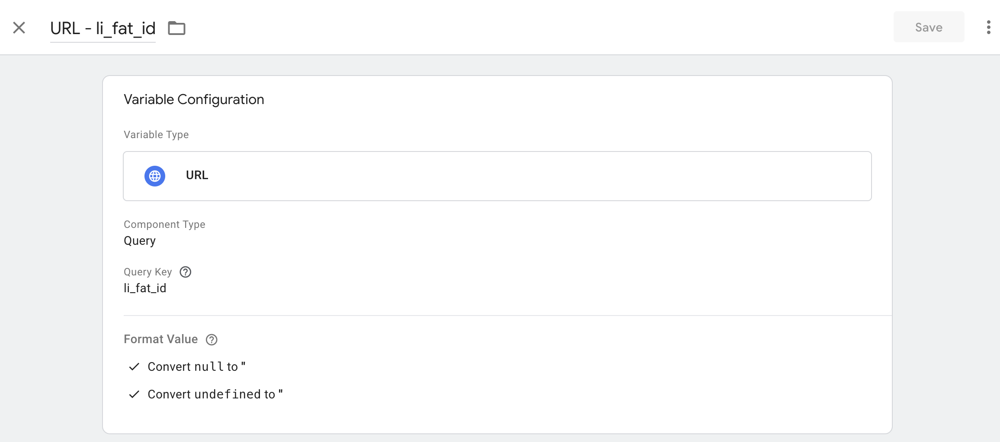
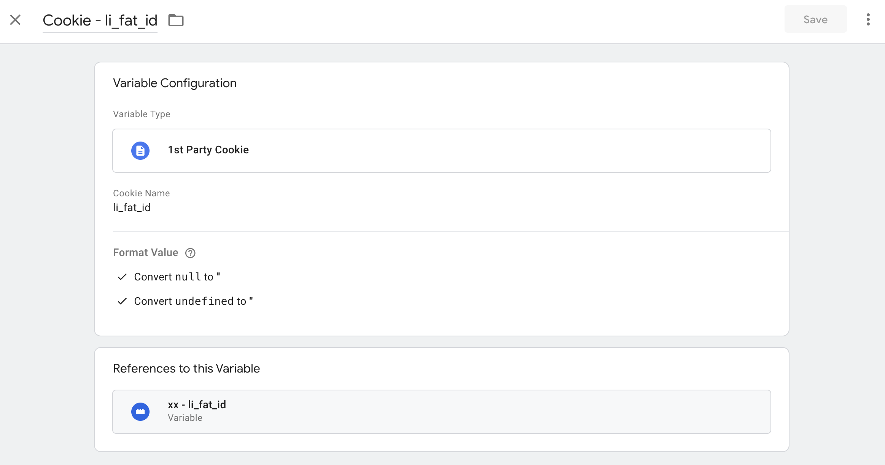
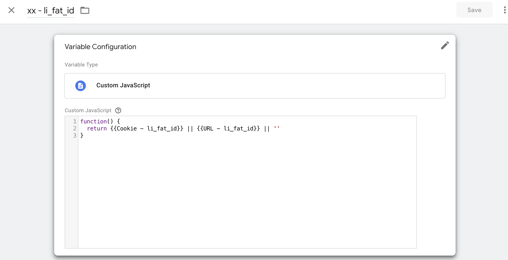
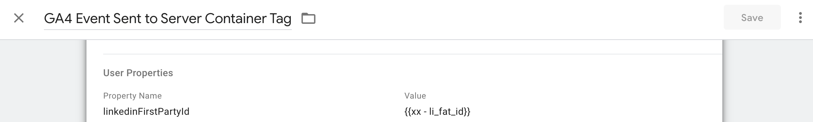

# linkedin-capi-tag-template

A Google Tag Manager (GTM) tag template that can be utilized to begin streaming conversion events to LinkedIn's Conversion API endpoint.

Further documentation can be found here: https://learn.microsoft.com/en-us/linkedin/marketing/integrations/ads-reporting/conversions-api

## CAPI Tag configuration :

- apiAccessToken (required) - GTM access token generated via [LinkedIn Campaign Manager](https://www.loom.com/share/0c9112dded1f4969b7581e4a745ec52c?sid=71265d81-986d-407d-914b-26b7ca7a2338) (1-year expiry) _Required_
- apiVersion (required) - e.g. 202403 - should not be more than 12 months from current data _Required_
- conversionRuleUrn (required) - CAPI Conversion Rule ID defined in LinkedIn Campaign Manager _Required_
- eventId (optional) - unique id generated by advertisers to indicate each event. If you set eventID value in CAPI configuration, it'll be used as default. If you send eventID via gtag function, it'll override the eventID value in CAPI configuration. If you don't set eventID value in CAPI configuration nor send in gtag function, eventID will be absent in the CAPI payload. If you plan to send eventId, you should map it to a dyanmic variable to deduplicate any event instance being sent to CAPI and Insight Tags. _Optional_
- conversionValue (optional) - The monetary value for this conversion. It contains “currencyCode” in ISO format (e.g. “USD”) and the “amount” value of the conversion in decimal string. (e.g. “100.00”). Advertisers can set conversion values dynamically here or set a fix value. ie: '{"currencyCode": "USD", "amount": "100.00"}'. If you set conversionValue in CAPI configuration, it'll be used as default. If you send conversionValue via datalayer.push function, it'll override the conversionValue value in CAPI configuration. If you don't set conversionValue value in CAPI configuration nor send in via datalayer.push function, conversionValue will be absent in the CAPI payload. If you send it via datalayer.push function, you should first push them as data layer variables, in GTM web containers forward the data layer values as GA4 event variables (currency, value) for that event instance. _Optional_

## How to send varaibles to CAPI from website

Send variables to CAPI from website using gtag function
[gtag function] as user_data (https://support.google.com/google-ads/answer/13258081?#Add_a_code_snippet&zippy=identify-and-define-your-enhanced-conversions-fields)

### Case 1 : LinkedIn First Party Ads Tracking UUID only, no First Party Data

You may implement the following [Javascript code](https://gist.github.com/otyeung/2c0619a08ff63bfd8b5c677c6b9b8767) on your website to send LinkedIn First Party Ads Tracking UUID to LinkedIn, using Google gtag function as user_data.

```javascript
/////////////////////////////////////// CAPI //////////////////////////////////////////
// read the value from LinkedIn 1st party cookie li_fat_id
function getCookie(name) {
  let matches = document.cookie.match(
    new RegExp(
      '(?:^|; )' + name.replace(/([.$?*|{}()[\]\\/+^])/g, '\\$1') + '=([^;]*)'
    )
  )

  // usually a cookie value is encoded, so decode it.
  return matches ? decodeURIComponent(matches[1]) : undefined
}

// Dynamically get the li_fat_id value from the browser or from 1st party cookie, set to variable li_fat_id
const li_fat_id =
  (typeof window !== 'undefined' &&
    new URLSearchParams(window.location.search).get('li_fat_id')) ||
  (typeof document !== 'undefined' && getCookie('li_fat_id')) ||
  ''

// pass parameter to GTM Web container via gtag function as "user_data", li_fat_id is dervied from URL and/or 1st party cookie
gtag('set', 'user_data', {
  linkedinFirstPartyId: li_fat_id,
})

// Register your event name to GTM Web container, replace 'button_click' with your own event name
// Use this event name for tag trigger
window.dataLayer = window.dataLayer || []
dataLayer.push({
  event: 'button_click',
})

/////////////////////////////////////// Insight Tags //////////////////////////////////
// Fire Event Specific Pixel -- replace xxxxxxx with your rule ID defined in CMT
window.lintrk('track', { conversion_id: xxxxxxx })
```

Alternatively you may implement the above logic in GTM web container without using gtag function.

### Case 2 : LinkedIn First Party Ads Tracking UUID and First Party Data

You may implement the following [Javascript code](https://gist.github.com/otyeung/4f2a86dbd10b925b4a09ff505add2589) on your website to send LinkedIn First Party Ads Tracking UUID using Google gtag function as user_data, and send First Party Data to LinkedIn using Google dataLayer.push function.

```javascript
/////////////////////////////////////// CAPI //////////////////////////////////////////
// read the value from LinkedIn 1st party cookie li_fat_id
function getCookie(name) {
  let matches = document.cookie.match(
    new RegExp(
      '(?:^|; )' + name.replace(/([.$?*|{}()[\]\\/+^])/g, '\\$1') + '=([^;]*)'
    )
  )

  // usually a cookie value is encoded, so decode it.
  return matches ? decodeURIComponent(matches[1]) : undefined
}

// Dynamically get the li_fat_id value from the browser or from 1st party cookie, set to variable li_fat_id
const li_fat_id =
  (typeof window !== 'undefined' &&
    new URLSearchParams(window.location.search).get('li_fat_id')) ||
  (typeof document !== 'undefined' && getCookie('li_fat_id')) ||
  ''

// Normalize and hash the email
const hashData = async (value) => {
  const encoder = new TextEncoder()
  const buffer = await crypto.subtle.digest('SHA-256', encoder.encode(value))
  const hashArray = Array.from(new Uint8Array(buffer))
  return hashArray
    .map((byte) => byte.toString(16).padStart(2, '0'))
    .join('')
    .toLowerCase()
}

// Assume you get email from your form, otherwise replae with your own variable name!
const hashedEmail = await hashData(formData.get('email'))

// pass parameter to GTM Web container via gtag function as "user_data", li_fat_id is dervied from URL and/or 1st party cookie
// replace your own variable for jobTitle, companyName, firstName, lastName, countryCode
// remove the variable if it does not exist in your website
gtag('set', 'user_data', {
  linkedinFirstPartyId: li_fat_id,
  email_address: formData.get('email'), // send either email_address OR hashed email, no need to send both
  sha256_email_address: hashedEmail, // send either email_address OR hashed email, no need to send both
  jobTitle: jobTitle,
  companyName: companyName,
  address: {
    first_name: firstName,
    last_name: lastName,
    country: countryCode, //
  },
})

// Register your event name to GTM Web container, replace 'button_click' with your own event name
// Push currency code (e.g. "USD") and conversion value (e.g. "100.00") to data layer for this event instance
// Use this event name for tag trigger
window.dataLayer = window.dataLayer || []
dataLayer.push({
  event: 'button_click',
  currency: formData.get('currency'),
  value: formData.get('value'),
})

/////////////////////////////////////// Insight Tags //////////////////////////////////
// Fire Event Specific Pixel -- replace xxxxxxx with your rule ID defined in CMT
window.lintrk('track', { conversion_id: xxxxxxx })

// Enhanced matching code, you may replace your own data below, the function below will hash the email at browser before sending to LinkedIn
// https://www.linkedin.com/help/lms/answer/a6241147
// https://www.linkedin.com/help/lms/answer/a6246095
window.lintrk('setUserData', { email: formData.get('email') })
```

- First Party Data includes email_address, sha256_email_address, first_name, last_name, jobTitle, companyName, country, currency, value, acxiomID, moatID, leadID. Your website may send ANY available data field(s) if available.
- You must send at least one of the following parameters: Email Address, LinkedIn First Party Ads Tracking UUID, Axciom ID, Oracle Moat ID, or First Name and Last Name, otherwise CAPI will return error
- If you send any user information (for example: Company, Title, or Country Code), you must include the First Name and Last Name parameters, regardless if you provide other identity parameters.
- LinkedIn First Party Ads Tracking UUID / li_fat_id / linkedinFirstPartyId can be sent by different ways : gtag function (user_data), or GTM web container GA4 user properties. In latter case, you don't need to add any gtag code in the website, instead you capture linkedinFirstPartyId directly in GTM web container
- email_address or sha256_email_address can be sent by gtag function (user_data). If sha256_email_address is sent, email_address will be ignored by CAPI. if sha256_email_address is not sent but email_address is available, it will be normalized and hashed by CAPI
- first_name, last_name can be sent by gtag function (user_data.address)
- jobTitle can be sent by gtag function (user_data)
- companyName can be sent by gtag function (user_data)
- country can be sent by gtag function (user_data.address). It should use ISO standardized two letter country code representing the country of the contact to match, e.g. "US"
- acxiomID can be sent by gtag function (user_data)
- moatID can be sent by gtag function (user_data)
- leadID can be sent by gtag function (user_data)

## How to capture linkedinFirstPartyId directly in GTM web container

You may implement the following to capture linkedinFirstPartyId directly in GTM web container without adding gtag code in website.

1. Capture linkedinFirstPartyId in GTM web container from URL and store it in URL variable



2. Capture linkedinFirstPartyId in GTM web container from 1st party cookie and store it in 1st party cookie varibale



3. Combine them as a single Javascript variable li_fat_id



4. Set the variable to GTM Web Container as user parameter linkedinFirstPartyId

This variable linkedinFirstPartyId shall be sent to GTM Server container as user parameter


